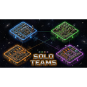

# 🏭 Solo Teams

> **Compete solo. Share the world.**

A Factorio 2.0 mod that gives each player their own independent force  - research your own tech tree, build your own factory, and progress at your own pace, all on the same shared map.

## 💬 Community

Join the Discord: **https://discord.gg/tWz4FT74pH**

## 🚀 Origin

Originally built for the [Space Block](https://mods.factorio.com/mod/yunrus-space-block) scenario, where each player gets their own space platform and races independently. Works with vanilla surfaces and other scenarios too.

## ✨ Features

### Core
- 🧑‍🚀 **Separate forces**  - Each player gets their own force (`player-<name>`) with independent research, quality unlocks, and space platform access copied from the default force.
- 🤝 **Neutral diplomacy**  - Players start in cease-fire (no friendly fire, no shared buildings). Opt into friendship per-player via the GUI.
- 💬 **Cross-force chat**  - Normal chat reaches all forces. No need for `/shout`.

### GUI Panels *(top-left nav bar)*
- 🗺️ **Players & Platforms**  - Live overview of all players, their surfaces, and GPS locations. Click to ping in chat.
- 📊 **Production Stats**  - Per-player item production comparison.
- 🔬 **Research**  - Tech icon grid ordered by research time. Click any player row for a 1-on-1 diff showing who has what and when they researched it.
- ⚙️ **Admin Panel**  - Runtime feature flags (Landing Pen toggle, etc.). Visible to the host only.
- ℹ️ **Welcome / Discord**  - Mod intro + Discord invite with scannable QR code.

### Landing Pen
- 🛬 New players wait in a pre-game lobby until they're ready to spawn.
- 👥 **Buddy system**  - Pair up with a friend to spawn on the same planet.
- 🔧 Admins can disable the pen to spawn players directly.

### Commands
- `/platforms`  - Lists all players and platforms with GPS pings.
- `/unstuck`  - Ejects from a vehicle and teleports to a safe position.

## 🔧 Installation

1. Download or clone into your Factorio mods folder as `solo-teams_0.2.7/`
2. Enable in the Factorio mod manager
3. Start or load a game  - solo forces are created automatically for each new player

## ⚙️ Compatibility

- Requires Factorio 2.0 (`base >= 2.0`)
- Works with [Space Block](https://mods.factorio.com/mod/yunrus-space-block) and vanilla surfaces
- Optional integration with [Space Exploration Platformer](https://mods.factorio.com/mod/space-exploration-platformer)
- Factorio supports up to 64 forces (~61 players after built-in forces)

## 📄 License

[MIT](LICENSE)
